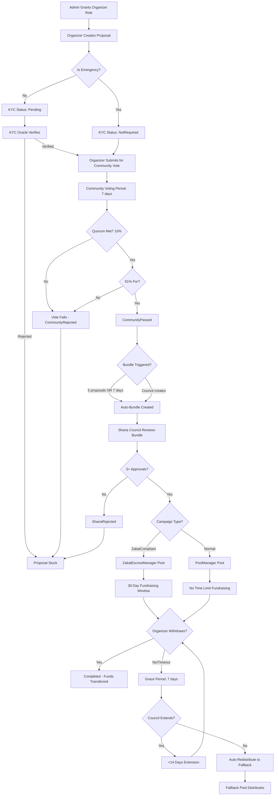
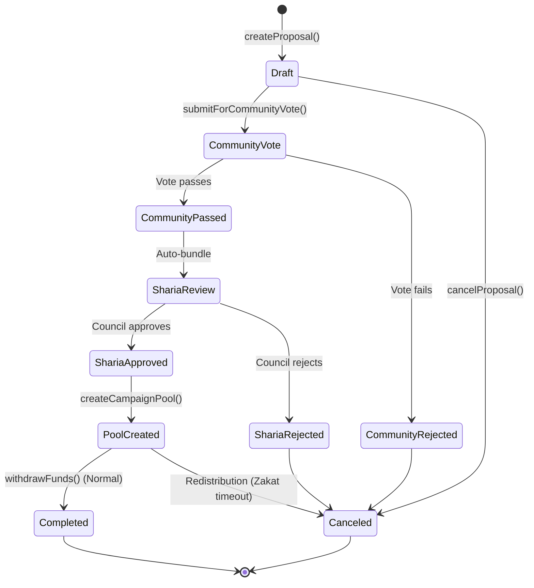
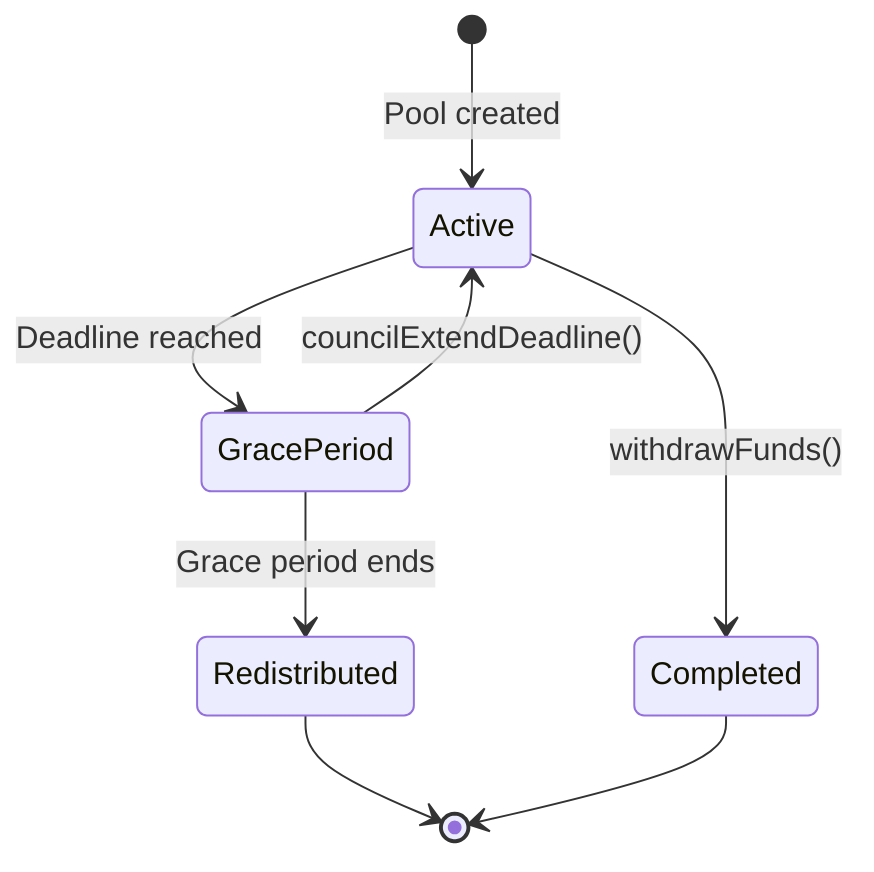
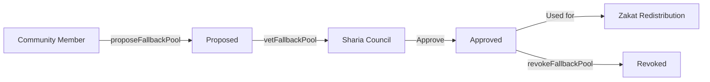
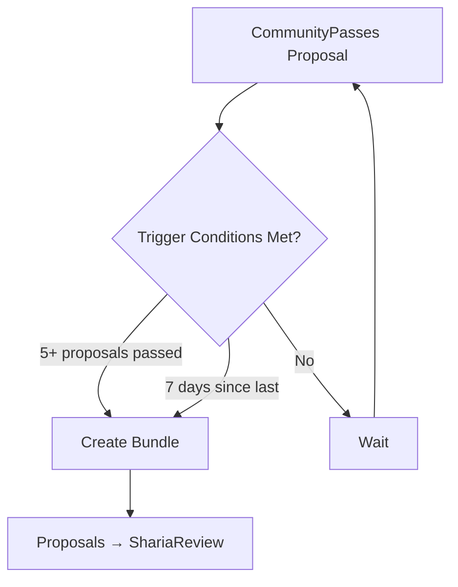

# ZKT Zakat DAO - Smart Contract Documentation

## Table of Contents

1. [System Overview](#1-system-overview)
2. [Architecture Diagram](#2-architecture-diagram)
3. [Participant Roles & Permissions](#3-participant-roles--permissions)
4. [Complete Campaign Flow](#4-complete-campaign-flow)
5. [Campaign Type Comparison](#5-campaign-type-comparison)
6. [Contract Reference Guide](#6-contract-reference-guide)
7. [Timeline Diagrams](#7-timeline-diagrams)

---

## 1. System Overview

The ZKT Zakat DAO is a decentralized platform for Sharia-compliant charitable crowdfunding. The system uses a modular architecture where different managers handle specific aspects of the campaign lifecycle.

### Key Design Principles

- **Sharia Compliance**: Zakat campaigns follow Shafi'i madhhab rulings with mandatory 30-day distribution limits
- **Community Governance**: Token holders vote on proposals before Sharia council review
- **Dual Campaign Types**: Zakat-compliant (with timeout) and Normal (without timeout)
- **Soulbound Tokens**: Voting power (vZKT) and donation receipts are non-transferable
- **Privacy Support**: Private donations using Pedersen commitments

### Token Ecosystem

| Token | Type | Purpose | Transferable |
|-------|------|---------|--------------|
| **IDRX** | ERC20 | Donation currency (stablecoin) | Yes |
| **vZKT** | ERC20 (Soulbound) | Governance voting power | No |
| **ZKT-RECEIPT** | ERC721 (Soulbound) | Donation receipt NFT | No |

---

## 2. Architecture Diagram

```
┌──────────────────────────────────────────────────────────────────────────┐
│                           ZKTCore (Orchestrator)                          │
│                     sc/src/DAO/ZKTCore.sol                                │
├──────────────────────────────────────────────────────────────────────────┤
│                                                                           │
│  ┌─────────────────┐  ┌─────────────────┐  ┌─────────────────┐          │
│  │  Proposal       │  │  Voting         │  │  Sharia         │          │
│  │  Manager        │  │  Manager        │  │  Review         │          │
│  │                 │  │                 │  │  Manager        │          │
│  │ - Proposals     │  │ - Community     │  │ - Bundling      │          │
│  │ - KYC           │  │   Voting        │  │ - Council       │          │
│  │ - Lifecycle     │  │ - Quorum        │  │   Review        │          │
│  └─────────────────┘  └─────────────────┘  └─────────────────┘          │
│                                                                           │
│  ┌─────────────────┐  ┌─────────────────┐                               │
│  │  Pool           │  │  Zakat          │                               │
│  │  Manager        │  │  Escrow         │                               │
│  │                 │  │  Manager        │                               │
│  │ - Normal        │  │ - Zakat Only    │                               │
│  │   Campaigns     │  │ - 30-Day        │                               │
│  │                 │  │   Timeout       │                               │
│  └─────────────────┘  └─────────────────┘                               │
│                                                                           │
└──────────────────────────────────────────────────────────────────────────┘
```

### Contract Locations

| Contract | Path | Purpose |
|----------|------|---------|
| ZKTCore | `sc/src/DAO/ZKTCore.sol` | Main orchestrator, role management |
| ProposalManager | `sc/src/DAO/core/ProposalManager.sol` | Proposal lifecycle, KYC |
| VotingManager | `sc/src/DAO/core/VotingManager.sol` | Community voting |
| ShariaReviewManager | `sc/src/DAO/core/ShariaReviewManager.sol` | Sharia council review |
| PoolManager | `sc/src/DAO/core/PoolManager.sol` | Normal campaign pools |
| ZakatEscrowManager | `sc/src/DAO/core/ZakatEscrowManager.sol` | Zakat campaign pools |
| IProposalManager | `sc/src/DAO/interfaces/IProposalManager.sol` | Interface and enums |
| VotingToken | `sc/src/tokens/VotingToken.sol` | Non-transferable voting token |
| DonationReceiptNFT | `sc/src/tokens/DonationReceiptNFT.sol` | Soulbound receipt NFT |
| MockIDRX | `sc/src/tokens/MockIDRX.sol` | Mock stable token |

---

## 3. Participant Roles & Permissions

### Role Matrix

| Role | How to Get | Key Permissions |
|------|------------|-----------------|
| **Organizer** | Granted by DEFAULT_ADMIN_ROLE via `grantOrganizerRole()` | Create proposals, submit for vote, cancel proposals, create pools, withdraw funds |
| **Sharia Council** | Granted by DEFAULT_ADMIN_ROLE via `grantShariaCouncilRole()` | Review proposals, vote in bundles, extend Zakat deadlines, approve fallback pools |
| **KYC Oracle** | Granted by DEFAULT_ADMIN_ROLE via `grantKYCOracleRole()` | Verify organizer KYC status |
| **Voter** | Call `grantVotingPower()` (permissionless) | Cast votes on community proposals |
| **Donor** | Hold IDRX tokens | Donate to campaigns (public or private) |
| **Admin** | DEFAULT_ADMIN_ROLE (deployer) | Grant all roles, configure parameters |

### Role Definitions (in Solidity)

```solidity
// In ZKTCore.sol
bytes32 public constant ORGANIZER_ROLE = keccak256("ORGANIZER_ROLE");
bytes32 public constant KYC_ORACLE_ROLE = keccak256("KYC_ORACLE_ROLE");
bytes32 public constant SHARIA_COUNCIL_ROLE = keccak256("SHARIA_COUNCIL_ROLE");
```

### How Roles Are Granted

```solidity
// Admin grants Organizer role
function grantOrganizerRole(address account) external onlyRole(DEFAULT_ADMIN_ROLE)

// Admin grants Sharia Council role
function grantShariaCouncilRole(address account) external onlyRole(DEFAULT_ADMIN_ROLE)

// Admin grants KYC Oracle role
function grantKYCOracleRole(address account) external onlyRole(DEFAULT_ADMIN_ROLE)

// Permissionless - anyone can request voting power
function grantVotingPower(address account, uint256 amount) external
```

---

## 4. Complete Campaign Flow

### Full Campaign Lifecycle



### Step-by-Step Breakdown

#### Step 1: Organizer Sign-Up
```solidity
// Admin grants organizer role
zktCore.grantOrganizerRole(organizerAddress);
```

#### Step 2: Create Proposal
```solidity
// Organizer creates proposal
uint256 proposalId = zktCore.createProposal(
    "Clean Water Mosque Project",     // title
    "Build wells for 5 villages...",  // description
    100000 * 10**18,                  // fundingGoal (100K IDRX)
    false,                            // isEmergency
    bytes32(0),                       // mockZKKYCProof
    ["Must reach poor only", "No overhead deducted"],  // zakatChecklistItems
    "ipfs://Qm..."                    // metadataURI
);
// Status: Draft, KYCStatus: Pending (or NotRequired if emergency)
```

#### Step 3: KYC Verification (Non-Emergency Only)
```solidity
// KYC Oracle verifies
zktCore.updateKYCStatus(proposalId, KYCStatus.Verified, "Identity confirmed");
// Required before community vote for non-emergency proposals
```

#### Step 4: Community Vote Submission
```solidity
// Organizer submits for vote
zktCore.submitForCommunityVote(proposalId);
// Status: CommunityVote
// Voting period: 7 days (configurable)
```

#### Step 5: Community Voting
```solidity
// Token holders cast votes (0=against, 1=for, 2=abstain)
zktCore.castVote(proposalId, 1);

// After voting period ends, anyone can finalize
bool passed = zktCore.finalizeCommunityVote(proposalId);
// Status: CommunityPassed OR CommunityRejected
```

#### Step 6: Sharia Review Bundle
```solidity
// Auto-bundled when:
// - 5+ proposals passed, OR
// - 7 days since last bundle
// Or council can create manually:
uint256 bundleId = zktCore.createShariaReviewBundle([1, 2, 3, 4, 5]);
// Status: ShariaReview
```

#### Step 7: Sharia Council Review
```solidity
// Each council member reviews
zktCore.reviewProposal(
    msg.sender,                       // reviewer
    bundleId,
    proposalId,
    true,                             // approved
    CampaignType.ZakatCompliant,      // campaign type
    bytes32(0)                        // mockZKReviewProof
);

// After all reviews, finalize
zktCore.finalizeShariaBundle(bundleId);
// Status: ShariaApproved OR ShariaRejected
```

#### Step 8: Create Campaign Pool
```solidity
// Organizer creates pool (routed automatically)
uint256 poolId = zktCore.createCampaignPool(
    proposalId,
    fallbackPoolAddress  // Required for Zakat campaigns
);
// ZakatCompliant -> ZakatEscrowManager
// Normal -> PoolManager
// Status: PoolCreated
```

#### Step 9: Donations
```solidity
// Public donation
idrxToken.approve(address(zktCore), amount);
zktCore.donate(poolId, amount, "ipfs://QmReceiptMetadata...");

// Private donation (Pedersen commitment)
zktCore.donatePrivate(poolId, amount, commitment, "ipfs://Qm...");
```

#### Step 10: Fund Withdrawal OR Redistribution

**Normal Campaign:**
```solidity
// Organizer can withdraw anytime
zktCore.withdrawFunds(poolId);
// Status: Completed
```

**Zakat Campaign:**
```solidity
// Organizer must withdraw within deadline (30 days + optional 14-day extension)
zktCore.withdrawFunds(poolId);

// If deadline passes:
checkZakatTimeout(poolId); // Enters Grace Period

// Council can extend during Grace Period
zktCore.councilExtendZakatDeadline(poolId, "ipfs://QmReasoning...");

// If no extension, after Grace Period ends:
zktCore.executeZakatRedistribution(poolId);
// Funds sent to fallback pool
```

---

## 5. Campaign Type Comparison

### Zakat vs Normal Campaigns

| Feature | Zakat Campaign | Normal Campaign |
|---------|----------------|-----------------|
| **Routing** | ZakatEscrowManager | PoolManager |
| **Distribution Time Limit** | 30 days (hard) | No limit |
| **Grace Period** | 7 days | N/A |
| **Council Extension** | +14 days (one-time) | N/A |
| **Redistribution** | To fallback pool if timeout | Manual only |
| **Use Case** | Must distribute Zakat immediately | General fundraising |

### Zakat Timeout Timeline

```
Day 0                     Day 30                    Day 37/44
├─────────────────────────┼─────────────────────────┤
│                         │                         │
│    Active Period        │    Grace Period         │    Redistribution
│    (Can Withdraw)       │    (Council Override)   │    (To Fallback)
│                         │                         │
│    ┌─────────────────┐  │    ┌─────────────────┐  │    ┌─────────────────┐
│    │ Organizer can   │  │    │ Council can     │  │    │ Anyone can     │
│    │ withdraw funds  │  │    │ grant +14 day   │  │    │ trigger         │
│    │                 │  │    │ extension       │  │    │ redistribution │
│    └─────────────────┘  │    └─────────────────┘  │    └─────────────────┘
│                         │                         │
└─────────────────────────┴─────────────────────────┴─────────────────────────┘

Total Window: 30 days (or 44 days with one-time council extension)
Grace Period: 7 days for council decision
After Grace Period: Auto-redistribute to fallback pool
```

---

## 6. Contract Reference Guide

### Enums (IProposalManager.sol)

```solidity
enum ProposalStatus {
    Draft,              // Initial state
    CommunityVote,      // Voting in progress
    CommunityPassed,    // Vote passed threshold
    CommunityRejected,  // Vote failed
    ShariaReview,       // In review bundle
    ShariaApproved,     // Council approved
    ShariaRejected,     // Council rejected
    PoolCreated,        // Fundraising pool created
    Completed,          // Funds withdrawn successfully
    Canceled            // Proposal canceled
}

enum KYCStatus {
    NotRequired,        // Emergency proposals
    Pending,            // Awaiting verification
    Verified,           // KYC approved
    Rejected            // KYC denied
}

enum CampaignType {
    Normal,             // No timeout restrictions
    ZakatCompliant      // 30-day distribution limit
}
```

### Key Constants

| Contract | Constant | Value | Description |
|----------|----------|-------|-------------|
| ProposalManager | `votingPeriod` | 7 days | Community voting duration |
| VotingManager | `quorumPercentage` | 10 | Min participation for validity |
| VotingManager | `passThreshold` | 51 | Min "for" votes to pass |
| ShariaReviewManager | `shariaQuorumRequired` | 3 | Min council approvals |
| ShariaReviewManager | `BUNDLE_THRESHOLD` | 5 | Proposals to auto-bundle |
| ShariaReviewManager | `BUNDLE_TIME_THRESHOLD` | 7 days | Max time between bundles |
| ZakatEscrowManager | `ZAKAT_PERIOD` | 30 days | Hard distribution limit |
| ZakatEscrowManager | `GRACE_PERIOD` | 7 days | Council override window |
| ZakatEscrowManager | `EXTENSION_DURATION` | 14 days | One-time extension |

### Key Functions by Contract

#### ZKTCore.sol (Main Orchestrator)

| Function | Access Control | Purpose |
|----------|----------------|---------|
| `grantOrganizerRole(address)` | Admin only | Grant organizer permissions |
| `grantShariaCouncilRole(address)` | Admin only | Grant council permissions |
| `grantKYCOracleRole(address)` | Admin only | Grant KYC verifier permissions |
| `grantVotingPower(address, uint256)` | Permissionless | Mint voting tokens |
| `createProposal(...)` | Organizer | Create new campaign proposal |
| `updateKYCStatus(uint256, KYCStatus, string)` | KYC Oracle | Update KYC status |
| `submitForCommunityVote(uint256)` | Organizer | Start voting period |
| `castVote(uint256, uint8)` | Any voter | Cast vote (0=no, 1=yes, 2=abstain) |
| `finalizeCommunityVote(uint256)` | Any | End voting and count |
| `createCampaignPool(uint256, address)` | Organizer | Create fundraising pool |
| `donate(uint256, uint256, string)` | Any | Donate to pool |
| `withdrawFunds(uint256)` | Organizer | Withdraw raised funds |

#### ProposalManager.sol

| Function | Access Control | Purpose |
|----------|----------------|---------|
| `createProposal(...)` | Organizer | Create proposal in Draft state |
| `updateKYCStatus(...)` | Admin/KYC Oracle | Set KYC status |
| `submitForCommunityVote(uint256)` | Organizer/Admin | Move to voting |
| `cancelProposal(uint256)` | Organizer/Admin | Cancel proposal |
| `setVotingPeriod(uint256)` | Admin | Configure voting duration |

#### VotingManager.sol

| Function | Access Control | Purpose |
|----------|----------------|---------|
| `castVote(address, uint256, uint8)` | VotingManager | Record vote with weight |
| `finalizeCommunityVote(uint256)` | Any | Calculate result |
| `setQuorumPercentage(uint256)` | Admin | Set min participation |
| `setPassThreshold(uint256)` | Admin | Set pass threshold |

#### ShariaReviewManager.sol

| Function | Access Control | Purpose |
|----------|----------------|---------|
| `checkAndCreateBundle()` | Any | Auto-bundle passed proposals |
| `createShariaReviewBundle(uint256[])` | Admin | Manual bundle creation |
| `reviewProposal(...)` | Sharia Council | Submit council review |
| `finalizeShariaBundle(uint256)` | Sharia Council | Count approvals |
| `setShariaQuorum(uint256)` | Admin | Set required approvals |

#### PoolManager.sol (Normal Campaigns)

| Function | Access Control | Purpose |
|----------|----------------|---------|
| `createCampaignPool(uint256)` | Admin | Create Normal campaign pool |
| `donate(address, uint256, uint256, string)` | PoolManager | Accept donations |
| `donatePrivate(...)` | PoolManager | Accept private donations |
| `withdrawFunds(address, uint256)` | Organizer | Withdraw all funds |

#### ZakatEscrowManager.sol (Zakat Campaigns)

| Function | Access Control | Purpose |
|----------|----------------|---------|
| `createZakatPool(uint256, address)` | Admin | Create Zakat pool with deadline |
| `donate(address, uint256, uint256, string)` | ZakatEscrow | Accept donations |
| `withdrawFunds(address, uint256)` | Organizer | Withdraw before deadline |
| `checkTimeout(uint256)` | Any | Update pool status |
| `councilExtendDeadline(uint256, string)` | Sharia Council | Grant +14 day extension |
| `executeRedistribution(uint256)` | Any | Send funds to fallback |
| `proposeFallbackPool(address, string)` | Any | Propose fallback |
| `vetFallbackPool(address)` | Sharia Council | Approve fallback |
| `setDefaultFallbackPool(address)` | Admin | Set default fallback |

---

## 7. Timeline Diagrams

### State Transition Diagram (Proposals)



### State Transition Diagram (Zakat Pools)



### Fallback Pool Flow



### Bundle Creation Triggers



---

## Appendix: Event Reference

### ProposalManager Events

```solidity
event ProposalCreated(uint256 indexed proposalId, address indexed organizer, string title, uint256 fundingGoal, bool isEmergency);
event KYCStatusUpdated(uint256 indexed proposalId, KYCStatus status, string notes);
event ProposalSubmitted(uint256 indexed proposalId, uint256 voteStart, uint256 voteEnd);
event ProposalCanceled(uint256 indexed proposalId);
```

### VotingManager Events

```solidity
event VoteCast(uint256 indexed proposalId, address indexed voter, uint8 support, uint256 weight);
event VotingPeriodEnded(uint256 indexed proposalId, bool passed, uint256 forVotes, uint256 againstVotes);
```

### ShariaReviewManager Events

```solidity
event ShariaReviewBundleCreated(uint256 indexed bundleId, uint256[] proposalIds);
event ProposalShariaApproved(uint256 indexed proposalId, CampaignType campaignType);
event ProposalShariaRejected(uint256 indexed proposalId);
event ShariaBundleFinalized(uint256 indexed bundleId);
```

### PoolManager Events

```solidity
event CampaignPoolCreated(uint256 indexed poolId, uint256 indexed proposalId, CampaignType campaignType);
event DonationReceived(uint256 indexed poolId, address indexed donor, uint256 amount, uint256 receiptTokenId);
event PrivateDonationReceived(uint256 indexed poolId, bytes32 indexed commitment, uint256 amount, uint256 receiptTokenId);
event FundingGoalReached(uint256 indexed poolId, uint256 totalRaised);
event FundsWithdrawn(uint256 indexed poolId, address indexed organizer, uint256 amount);
```

### ZakatEscrowManager Events

```solidity
event ZakatPoolCreated(uint256 indexed poolId, uint256 indexed proposalId, address organizer, uint256 deadline, address fallbackPool);
event DonationReceived(uint256 indexed poolId, address indexed donor, uint256 amount, uint256 receiptTokenId);
event PrivateDonationReceived(uint256 indexed poolId, bytes32 indexed commitment, uint256 amount, uint256 receiptTokenId);
event FundsWithdrawn(uint256 indexed poolId, address indexed organizer, uint256 amount);
event PoolEnteredGracePeriod(uint256 indexed poolId, uint256 gracePeriodEnd);
event DeadlineExtended(uint256 indexed poolId, uint256 newDeadline, string reasoning);
event FundsRedistributed(uint256 indexed poolId, address indexed fallbackPool, uint256 amount);
event FallbackPoolProposed(address indexed pool, address indexed proposer, string reasoning);
event FallbackPoolVetted(address indexed pool, address indexed councilMember);
event FallbackPoolApproved(address indexed pool);
event FallbackPoolRevoked(address indexed pool);
event DefaultFallbackPoolSet(address indexed pool);
```

---

*Document Version: 1.0*
*Last Updated: 2026-01-26*
*Solidity Version: ^0.8.31*
