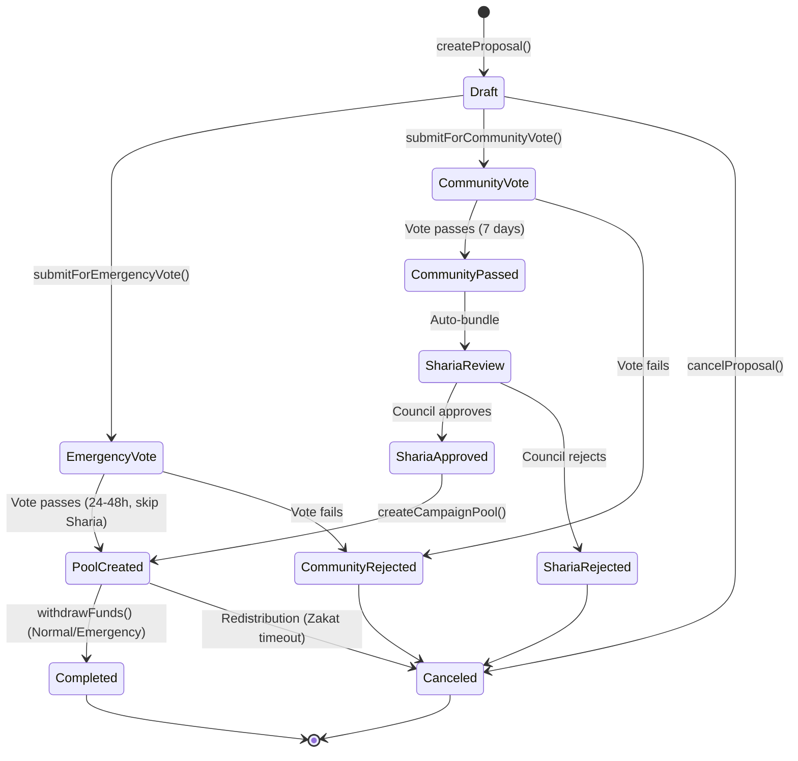
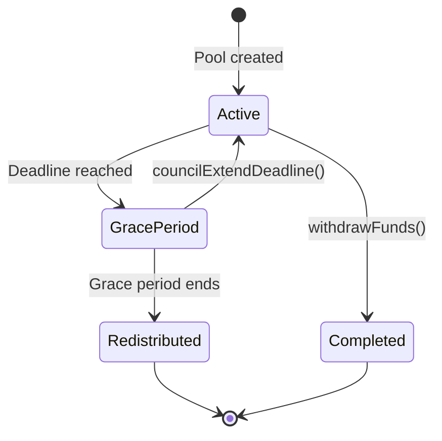
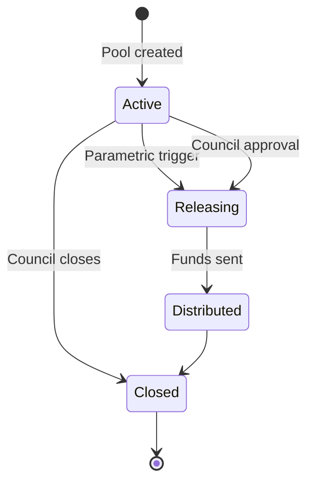
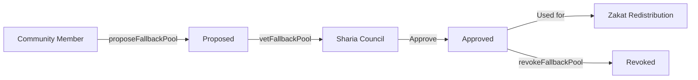
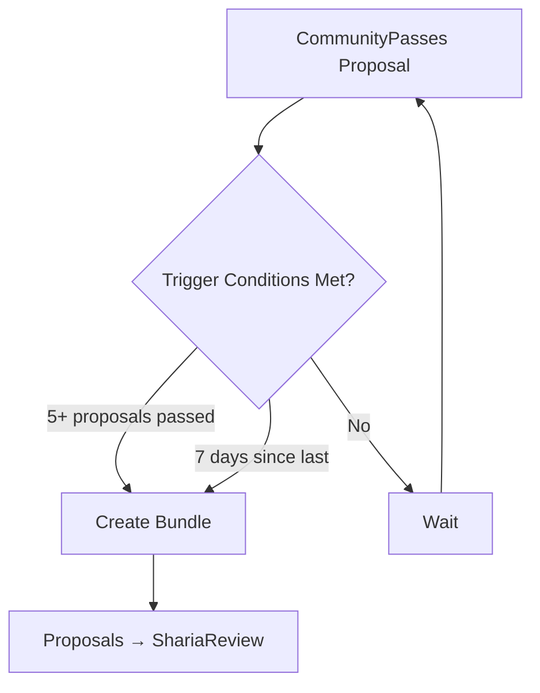

# ZKT Zakat DAO - Smart Contract Documentation

## Table of Contents

1. [System Overview](#1-system-overview)
2. [Architecture Diagram](#2-architecture-diagram)
3. [Participant Roles & Permissions](#3-participant-roles--permissions)
4. [Complete Campaign Flow](#4-complete-campaign-flow)
5. [Campaign Type Comparison](#5-campaign-type-comparison)
6. [Contract Reference Guide](#6-contract-reference-guide)
7. [Timeline Diagrams](#7-timeline-diagrams)

---

## 1. System Overview

The ZKT Zakat DAO is a decentralized platform for Sharia-compliant charitable crowdfunding. The system uses a modular architecture where different managers handle specific aspects of the campaign lifecycle.

### Key Design Principles

- **Sharia Compliance**: Zakat campaigns follow Shafi'i madhhab rulings with mandatory 30-day distribution limits
- **Community Governance**: Token holders vote on proposals before Sharia council review
- **Hybrid Organizer Approval**: Community proposes + Sharia council approves new organizers (decentralized)
- **Triple Campaign Types**: Zakat-compliant, Normal, and Emergency (DRCP-style)
- **Soulbound Tokens**: Voting power (vZKT) and donation receipts are non-transferable
- **Privacy Support**: Private donations using Pedersen commitments

### Token Ecosystem

| Token | Type | Purpose | Transferable |
|-------|------|---------|--------------|
| **IDRX** | ERC20 | Donation currency (stablecoin) | Yes |
| **vZKT** | ERC721 (NFT) | Governance voting power NFT | No |
| **ZKT-RECEIPT** | ERC721 (Soulbound) | Donation receipt NFT | No |

---

## 2. Architecture Diagram

```
┌──────────────────────────────────────────────────────────────────────────┐
│                           ZKTCore (Orchestrator)                          │
│                     sc/src/DAO/ZKTCore.sol                                │
├──────────────────────────────────────────────────────────────────────────┤
│                                                                           │
│  ┌─────────────────┐  ┌─────────────────┐  ┌─────────────────┐          │
│  │  Proposal       │  │  Voting         │  │  Sharia         │          │
│  │  Manager        │  │  Manager        │  │  Review         │          │
│  │                 │  │                 │  │  Manager        │          │
│  │ - Proposals     │  │ - Community     │  │ - Bundling      │          │
│  │ - KYC Registry  │  │   Voting        │  │ - Council       │          │
│  │ - Lifecycle     │  │ - Expedited     │  │   Review        │          │
│  │                 │  │   (Emergency)   │  │ - Expedited     │          │
│  └─────────────────┘  └─────────────────┘  └─────────────────┘          │
│                                                                           │
│  ┌─────────────────┐  ┌─────────────────┐  ┌─────────────────┐          │
│  │  Pool           │  │  Zakat          │  │  Emergency      │          │
│  │  Manager        │  │  Escrow         │  │  Escrow         │          │
│  │                 │  │  Manager        │  │  (DRCP)         │          │
│  │ - Normal        │  │ - Zakat Only    │  │ - Disaster     │          │
│  │   Campaigns     │  │ - 30-Day        │  │   Response     │          │
│  │                 │  │   Timeout       │  │ - Fast Track   │          │
│  └─────────────────┘  └─────────────────┘  └─────────────────┘          │
│                                                                           │
└──────────────────────────────────────────────────────────────────────────┘
```

### Contract Locations

| Contract | Path | Purpose |
|----------|------|---------|
| ZKTCore | `sc/src/DAO/ZKTCore.sol` | Main orchestrator, coordinator |
| ProposalManager | `sc/src/DAO/core/ProposalManager.sol` | Proposal lifecycle, KYC registry |
| VotingManager | `sc/src/DAO/core/VotingManager.sol` | Community voting (expedited for emergency) |
| ShariaReviewManager | `sc/src/DAO/core/ShariaReviewManager.sol` | Sharia council review (expedited for emergency) |
| PoolManager | `sc/src/DAO/core/PoolManager.sol` | Normal campaign pools |
| ZakatEscrowManager | `sc/src/DAO/core/ZakatEscrowManager.sol` | Zakat campaign pools with timeout |
| EmergencyEscrowManager | `sc/src/DAO/core/EmergencyEscrowManager.sol` | DRCP-style disaster response pools |
| IProposalManager | `sc/src/DAO/interfaces/IProposalManager.sol` | Interface and enums |
| VotingToken | `sc/src/tokens/VotingToken.sol` | Non-transferable voting token |
| DonationReceiptNFT | `sc/src/tokens/DonationReceiptNFT.sol` | Soulbound receipt NFT |
| MockIDRX | `sc/src/tokens/MockIDRX.sol` | Mock stable token |

---

## 3. Participant Roles & Permissions

### Role Matrix

| Role | How to Get | Key Permissions |
|------|------------|-----------------|
| **Organizer** | **Hybrid Flow**: Community proposes organizer → Sharia council approves → KYC Oracle verifies identity | Create proposals, submit for vote, cancel proposals, create pools, withdraw funds |
| **Sharia Council** | Granted by DEFAULT_ADMIN_ROLE via `grantShariaCouncilRole()` | Review proposals, approve organizers, vote in bundles, extend Zakat deadlines, approve fallback pools |
| **KYC Oracle** | Granted by DEFAULT_ADMIN_ROLE via `grantKYCOracleRole()` | Verify organizer identity (required BEFORE organizer can submit proposals) |
| **Voter** | Receive vZKT NFT (permissionless) | Cast votes on community proposals AND organizer applications (voting power from NFT) |
| **Donor** | Hold IDRX tokens | Donate to campaigns (public or private) |
| **Admin** | DEFAULT_ADMIN_ROLE (deployer) | Configure parameters, grant Sharia Council/KYC Oracle roles |

### Important: KYC Registry vs Recipient KYC

| Type | Description | When Required |
|------|-------------|---------------|
| **Organizer KYC Registry** | Identity verification of the person applying to be an organizer | Required BEFORE community votes on organizer application |
| **Recipient KYC** | Identity verification of individuals who will receive the funds | Required for Normal/Zakat campaigns (not Emergency) |

### Organizer Application Flow (Hybrid - Decentralized)

```
┌─────────────────────────────────────────────────────────────────┐
│                    ORGANIZER APPLICATION FLOW                   │
├─────────────────────────────────────────────────────────────────┤
│                                                                 │
│  1. Applicant calls proposeOrganizer(address, string reasoning) │
│     → Creates proposal type: "OrganizerApplication"            │
│                                                                 │
│  2. KYC Oracle verifies applicant identity                      │
│     → updateOrganizerKYC(address, KYCStatus.Verified)           │
│     → Required BEFORE community vote                            │
│                                                                 │
│  3. Community votes on organizer application (7 days)           │
│     → Token holders decide if applicant is trustworthy          │
│                                                                 │
│  4. Sharia Council reviews (expedited bundle)                   │
│     → Council verifies applicant meets Sharia standards         │
│                                                                 │
│  5. If both approve: grantOrganizerRole(address)                │
│     → Organizer can now create proposals                        │
│                                                                 │
└─────────────────────────────────────────────────────────────────┘
```

### Role Definitions (in Solidity)

```solidity
// In ZKTCore.sol
bytes32 public constant ORGANIZER_ROLE = keccak256("ORGANIZER_ROLE");
bytes32 public constant KYC_ORACLE_ROLE = keccak256("KYC_ORACLE_ROLE");
bytes32 public constant SHARIA_COUNCIL_ROLE = keccak256("SHARIA_COUNCIL_ROLE");
```

### How Roles Are Granted

```solidity
// ========== DECENTRALIZED ORGANIZER APPROVAL ==========
// Step 1: Community member proposes new organizer
function proposeOrganizer(address applicant, string memory reasoning)
    external
    returns (uint256 applicationId)

// Step 2: KYC Oracle verifies applicant identity (REQUIRED before vote)
function updateOrganizerKYC(address applicant, KYCStatus status, string notes)
    external
    onlyRole(KYC_ORACLE_ROLE)

// Step 3: Community votes (uses same VotingManager)
function castVote(uint256 applicationId, uint8 support) external

// Step 4: After community + Sharia approval
function finalizeOrganizerGrant(address applicant, uint256 applicationId)
    external
    onlyRole(SHARIA_COUNCIL_ROLE)

// ========== COUNCIL ROLES (Admin-granted) ==========
// Admin grants Sharia Council role
function grantShariaCouncilRole(address account) external onlyRole(DEFAULT_ADMIN_ROLE)

// Admin grants KYC Oracle role
function grantKYCOracleRole(address account) external onlyRole(DEFAULT_ADMIN_ROLE)

// ========== VOTING (Permissionless NFT-based) ==========
// Permissionless - anyone can request voting power NFT
function grantVotingPowerNFT(address account) external
```

---

## 4. Complete Campaign Flow

### Campaign Type Overview

| Campaign Type | Manager | Recipient KYC Required | Voting Period | Sharia Review | Time Limit |
|---------------|---------|------------------------|---------------|----------------|------------|
| **Normal** | PoolManager | Yes (verify recipients) | 7 days | Standard bundle | None |
| **Zakat** | ZakatEscrowManager | Yes (verify recipients) | 7 days | Standard bundle | 30-day distribution |
| **Emergency** | EmergencyEscrowManager | No (disaster victims) | 24-48 hours (prioritized) | SKIPS 7-day period | DRCP rules |

### Key Emergency Proposal Rules

- **Organizer MUST be in KYC Registry** (verified beforehand)
- **Recipients do NOT need KYC** (disaster victims, urgent aid scenarios)
- **Expedited community voting** (24-48 hours instead of 7 days, prioritized queue)
- **SKIPS Sharia review period** (no 7-day wait, immediate approval after community vote)
- **Uses EmergencyEscrowManager** (DRCP-style parametric disaster response)

### Full Campaign Lifecycle

```mermaid
flowchart TD
    A[1. Organizer Application Flow] --> B[Applicant Applies]
    B --> C[KYC Oracle Verifies Identity]
    C --> D[Community Votes on Applicant]
    D --> E[Sharia Council Reviews]
    E -->|Approved| F[Organizer Role Granted]
    E -->|Rejected| X[Application Rejected]

    F --> G[2. Campaign Creation Flow]
    G --> H{Campaign Type?}

    H -->|Emergency| I[EmergencyEscrowManager]
    H -->|Zakat| J[ZakatEscrowManager]
    H -->|Normal| K[PoolManager]

    I --> L[No Recipient KYC Needed]
    L --> M[Expedited Voting: 24-48h (Prioritized)]
    M --> O[SKIP Sharia Review]
    O --> P[Emergency Pool Created]

    J --> Q[Recipient KYC Required]
    Q --> R[Community Vote: 7 days]
    R --> S{Vote Passes?}
    S -->|Yes| T[Auto-Bundle Sharia Review]
    S -->|No| X
    T --> U{Sharia Approves?}
    U -->|Yes| V[Zakat Pool Created]
    U -->|No| X

    K --> W[Recipient KYC Required]
    W --> R

    P --> Y[Emergency Pool Rules]
    Y --> Z[Parametric Distribution]
    Z --> AA[Instant Fund Release]

    V --> AB[Zakat Pool Rules]
    AB --> AC[30-Day Fundraising]
    AC --> AD{Organizer Distributes?}
    AD -->|Yes| AE[Completed]
    AD -->|No/Timeout| AF[Grace Period 7 days]
    AF --> AG{Council Extends?}
    AG -->|Yes| AH[+14 Days]
    AG -->|No| AI[Redistribute to Fallback]
```

### Step-by-Step Breakdown

#### Phase 1: Organizer Application (Hybrid - Decentralized)

```solidity
// Step 1: Applicant submits organizer application
uint256 applicationId = zktCore.proposeOrganizer(
    applicantAddress,
    "Experienced NGO worker, 5 years in disaster relief..."
);

// Step 2: KYC Oracle verifies applicant IDENTITY (before community vote)
zktCore.updateOrganizerKYC(
    applicantAddress,
    KYCStatus.Verified,
    "Passport verified, background check passed"
);

// Step 3: Community votes on organizer application
zktCore.castVote(applicationId, 1); // 1 = for

// Step 4: After vote passes, Sharia Council reviews (expedited)
zktCore.finalizeOrganizerGrant(applicantAddress, applicationId);
// ORGANIZER_ROLE granted - can now create proposals
```

#### Phase 2: Create Proposal

**Emergency Proposal:**
```solidity
// Organizer creates emergency proposal
uint256 proposalId = zktCore.createProposal(
    "Earthquake Relief - Aceh",       // title
    "Immediate relief for earthquake victims...", // description
    500000 * 10**18,                  // fundingGoal (500K IDRX)
    true,                             // isEmergency = TRUE
    bytes32(0),                       // mockZKKYCProof (recipients not needed)
    [],                               // zakatChecklistItems (empty for emergency)
    "ipfs://Qm..."                    // metadataURI
);
// Status: Draft, KYCStatus: NotRequired (disaster victims)
```

**Normal/Zakat Proposal:**
```solidity
// Organizer creates zakat proposal
uint256 proposalId = zktCore.createProposal(
    "Clean Water Mosque Project",     // title
    "Build wells for 5 villages...",  // description
    100000 * 10**18,                  // fundingGoal (100K IDRX)
    false,                            // isEmergency = FALSE
    bytes32(0),                       // mockZKKYCProof (for recipients)
    ["Must reach poor only", "No overhead deducted"],  // zakatChecklistItems
    "ipfs://Qm..."                    // metadataURI
);
// Status: Draft, KYCStatus: Pending (recipients need verification)
```

#### Phase 3: Recipient KYC Verification (Normal/Zakat Only)

```solidity
// KYC Oracle verifies the RECIPIENTS who will receive funds
zktCore.updateKYCStatus(proposalId, KYCStatus.Verified, "Recipients verified: 50 families in Village A");
// Required before community vote for non-emergency proposals
// Emergency proposals skip this (disaster victims don't need pre-verification)
```

#### Phase 4: Community Vote (No KYC Step Needed)

**Emergency - Expedited (24-48 hours, prioritized queue):**
```solidity
zktCore.submitForEmergencyVote(proposalId);
// Voting period: 24-48 hours (prioritized queue)
// Quorum: Reduced threshold for fast response
// NFT holders vote with their vZKT NFT power
```

**Normal/Zakat - Standard (7 days):**
```solidity
zktCore.submitForCommunityVote(proposalId);
// Voting period: 7 days
// Quorum: 10% of vZKT NFT supply
// NFT holders vote with their vZKT NFT power
```

#### Phase 5: Sharia Council Review (Emergency Skips This)

**Emergency - SKIPS Sharia Review:**
```solidity
// Emergency proposals skip Sharia review entirely
// After community vote passes, pool is created immediately
uint256 poolId = zktCore.createCampaignPool(proposalId, fallbackPoolAddress);
// Campaign type auto-determined: Emergency
```

**Normal/Zakat - Standard Bundle:**
```solidity
// Auto-bundled when: 5+ proposals OR 7 days since last bundle
uint256 bundleId = zktCore.createShariaReviewBundle([1, 2, 3, 4, 5]);

// Each council member reviews
zktCore.reviewProposal(msg.sender, bundleId, proposalId, true, CampaignType.ZakatCompliant, bytes32(0));

// Finalize bundle
zktCore.finalizeShariaBundle(bundleId);
```

#### Phase 6: Create Campaign Pool

```solidity
// Organizer creates pool (auto-routed by campaign type)
uint256 poolId = zktCore.createCampaignPool(proposalId, fallbackPoolAddress);

// Routing:
// Emergency  -> EmergencyEscrowManager (DRCP-style)
// Zakat      -> ZakatEscrowManager (30-day timeout)
// Normal     -> PoolManager (no timeout)
```

#### Phase 7: Donations

```solidity
// Public donation
idrxToken.approve(address(zktCore), amount);
zktCore.donate(poolId, amount, "ipfs://QmReceiptMetadata...");

// Private donation (Pedersen commitment)
zktCore.donatePrivate(poolId, amount, commitment, "ipfs://Qm...");
```

#### Phase 8: Fund Distribution

**Emergency Pool (DRCP Rules):**
```solidity
// Parametric triggers or council approval for instant release
zktCore.executeEmergencyRelease(poolId, amount, "ipfs://QmProof...");
// Funds released immediately to verified recipients
```

**Normal Pool:**
```solidity
// Organizer can withdraw anytime
zktCore.withdrawFunds(poolId);
```

**Zakat Pool:**
```solidity
// Organizer must withdraw within deadline (30 + optional 14 days)
zktCore.withdrawFunds(poolId);

// If deadline passes:
zktCore.checkZakatTimeout(poolId); // Enters Grace Period

// Council can extend during Grace Period
zktCore.councilExtendZakatDeadline(poolId, "ipfs://QmReasoning...");

// If no extension, after Grace Period ends:
zktCore.executeZakatRedistribution(poolId);
// Funds sent to fallback pool
```

---

## 5. Campaign Type Comparison

### All Three Campaign Types

| Feature | Emergency (DRCP) | Zakat Campaign | Normal Campaign |
|---------|-----------------|----------------|-----------------|
| **Manager** | EmergencyEscrowManager | ZakatEscrowManager | PoolManager |
| **Recipient KYC** | Not required (disaster victims) | Required (verify recipients) | Required (verify recipients) |
| **Voting Period** | 24-48 hours (prioritized queue) | 7 days | 7 days |
| **Sharia Review** | SKIPPED (immediate after vote) | Standard bundle | Standard bundle |
| **Distribution** | Parametric/Instant | 30-day limit | No limit |
| **Grace Period** | N/A | 7 days | N/A |
| **Extension** | N/A | +14 days (one-time) | N/A |
| **Redistribution** | DRCP rules | To fallback pool | Manual only |
| **Use Case** | Disaster relief, urgent aid | Zakat obligations | General fundraising |

### Emergency Campaign (DRCP Model)

Based on the **Disaster Response Coordination Protocol (DRCP)**:

```
┌─────────────────────────────────────────────────────────────────┐
│                    EMERGENCY ESCROW MANAGER                     │
│                    (DRCP-Style Disaster Response)               │
├─────────────────────────────────────────────────────────────────┤
│                                                                 │
│  Key Features:                                                  │
│  ┌─────────────────────────────────────────────────────────┐   │
│  │ • 72-hour latency gap elimination                       │   │
│  │ • Parametric triggers for automatic fund release        │   │
│  │ • SKIPS Sharia council review (immediate after vote)    │   │
│  │ • Zero intermediaries - direct to victims               │   │
│  │ • Impact NFTs for volunteer verification                │   │
│  └─────────────────────────────────────────────────────────┘   │
│                                                                 │
│  Flow:                                                          │
│  ┌──────────┐    ┌──────────┐    ┌──────────┐                  │
│  │ Disaster │ -> │ Expedited│ -> │ Instant  │                  │
│  │ Detected │    │ Vote     │    │ Release  │                  │
│  └──────────┘    └──────────┘    └──────────┘                  │
│      (24-48h)       (24-48h)       (minutes)                   │
│                                                                 │
└─────────────────────────────────────────────────────────────────┘
```

### Zakat Timeout Timeline

```
Day 0                     Day 30                    Day 37/44
├─────────────────────────┼─────────────────────────┤
│                         │                         │
│    Active Period        │    Grace Period         │    Redistribution
│    (Can Withdraw)       │    (Council Override)   │    (To Fallback)
│                         │                         │
│    ┌─────────────────┐  │    ┌─────────────────┐  │    ┌─────────────────┐
│    │ Organizer can   │  │    │ Council can     │  │    │ Anyone can     │
│    │ withdraw funds  │  │    │ grant +14 day   │  │    │ trigger         │
│    │                 │  │    │ extension       │  │    │ redistribution │
│    └─────────────────┘  │    └─────────────────┘  │    └─────────────────┘
│                         │                         │
└─────────────────────────┴─────────────────────────┴─────────────────────────┘

Total Window: 30 days (or 44 days with one-time council extension)
Grace Period: 7 days for council decision
After Grace Period: Auto-redistribute to fallback pool
```

### Emergency vs Standard Comparison

| Aspect | Emergency | Standard (Zakat/Normal) |
|--------|-----------|------------------------|
| **Organizer Verification** | Must be in KYC Registry beforehand | Must be in KYC Registry beforehand |
| **Recipient KYC** | Not required (disaster victims) | Required (verify fund recipients) |
| **Voting Queue** | Prioritized queue (24-48h) | Standard queue (7 days) |
| **Quorum Threshold** | Reduced for speed | 10% of vZKT NFT supply |
| **Sharia Review** | SKIPPED entirely | Bundled (5 or 7 days) |
| **Fund Release** | Parametric or council-approved | Organizer withdraws |
| **Time to Funds** | Hours | Days to weeks |

---

## 6. Contract Reference Guide

### Enums (IProposalManager.sol)

```solidity
enum ProposalStatus {
    Draft,              // Initial state
    CommunityVote,      // Voting in progress
    CommunityPassed,    // Vote passed threshold
    CommunityRejected,  // Vote failed
    ShariaReview,       // In review bundle
    ShariaApproved,     // Council approved
    ShariaRejected,     // Council rejected
    PoolCreated,        // Fundraising pool created
    Completed,          // Funds withdrawn successfully
    Canceled            // Proposal canceled
}

enum KYCStatus {
    NotRequired,        // Emergency proposals (organizer pre-verified)
    Pending,            // Awaiting verification
    Verified,           // KYC approved
    Rejected            // KYC denied
}

enum CampaignType {
    Normal,             // No timeout restrictions
    ZakatCompliant,     // 30-day distribution limit
    Emergency           // DRCP-style disaster response
}
```

### Key Constants

| Contract | Constant | Value | Description |
|----------|----------|-------|-------------|
| ProposalManager | `votingPeriod` | 7 days | Standard community voting duration |
| ProposalManager | `emergencyVotingPeriod` | 24-48 hours | Expedited voting for emergencies |
| VotingManager | `quorumPercentage` | 10 | Min NFT participation for validity (standard) |
| VotingManager | `emergencyQuorumPercentage` | 5 | Reduced NFT quorum for emergencies |
| VotingManager | `passThreshold` | 51 | Min "for" votes to pass |
| ShariaReviewManager | `shariaQuorumRequired` | 3 | Min council approvals |
| ShariaReviewManager | `BUNDLE_THRESHOLD` | 5 | Proposals to auto-bundle |
| ShariaReviewManager | `BUNDLE_TIME_THRESHOLD` | 7 days | Max time between bundles |
| ShariaReviewManager | `emergencyReviewPeriod` | 7 days | Expedited Sharia review |
| ZakatEscrowManager | `ZAKAT_PERIOD` | 30 days | Hard distribution limit |
| ZakatEscrowManager | `GRACE_PERIOD` | 7 days | Council override window |
| ZakatEscrowManager | `EXTENSION_DURATION` | 14 days | One-time extension |
| EmergencyEscrowManager | `PARAMETRIC_TRIGGER_WINDOW` | TBD | Window for parametric execution |

### Key Functions by Contract

#### ZKTCore.sol (Main Orchestrator)

| Function | Access Control | Purpose |
|----------|----------------|---------|
| `proposeOrganizer(address, string)` | Permissionless | Create organizer application proposal |
| `updateOrganizerKYC(address, KYCStatus, string)` | KYC Oracle | Verify organizer applicant identity |
| `finalizeOrganizerGrant(address, uint256)` | Sharia Council | Grant organizer role after approvals |
| `grantShariaCouncilRole(address)` | Admin only | Grant council permissions |
| `grantKYCOracleRole(address)` | Admin only | Grant KYC verifier permissions |
| `grantVotingPowerNFT(address)` | Permissionless | Mint voting power NFT |
| `createProposal(...)` | Organizer | Create new campaign proposal |
| `updateKYCStatus(uint256, KYCStatus, string)` | KYC Oracle | Update recipient KYC status |
| `submitForCommunityVote(uint256)` | Organizer | Start standard voting period |
| `submitForEmergencyVote(uint256)` | Organizer | Start expedited voting |
| `castVote(uint256, uint8)` | Any voter | Cast vote (0=no, 1=yes, 2=abstain) |
| `finalizeCommunityVote(uint256)` | Any | End voting and count |
| `reviewEmergencyProposal(uint256, bool, bytes32)` | Sharia Council | Expedited emergency review (deprecated - emergency skips Sharia) |
| `createCampaignPool(uint256, address)` | Organizer | Create fundraising pool |
| `donate(uint256, uint256, string)` | Any | Donate to pool |
| `withdrawFunds(uint256)` | Organizer | Withdraw raised funds |
| `executeEmergencyRelease(uint256, uint256, string)` | Emergency pool | Parametric fund release |

#### ProposalManager.sol

| Function | Access Control | Purpose |
|----------|----------------|---------|
| `createProposal(...)` | Organizer | Create proposal in Draft state |
| `updateKYCStatus(...)` | Admin/KYC Oracle | Set KYC status |
| `submitForCommunityVote(uint256)` | Organizer/Admin | Move to voting |
| `cancelProposal(uint256)` | Organizer/Admin | Cancel proposal |
| `setVotingPeriod(uint256)` | Admin | Configure voting duration |

#### VotingManager.sol

| Function | Access Control | Purpose |
|----------|----------------|---------|
| `castVote(address, uint256, uint8)` | VotingManager | Record vote with weight |
| `finalizeCommunityVote(uint256)` | Any | Calculate result |
| `setQuorumPercentage(uint256)` | Admin | Set min participation |
| `setPassThreshold(uint256)` | Admin | Set pass threshold |

#### ShariaReviewManager.sol

| Function | Access Control | Purpose |
|----------|----------------|---------|
| `checkAndCreateBundle()` | Any | Auto-bundle passed proposals |
| `createShariaReviewBundle(uint256[])` | Admin | Manual bundle creation |
| `reviewProposal(...)` | Sharia Council | Submit council review |
| `finalizeShariaBundle(uint256)` | Sharia Council | Count approvals |
| `setShariaQuorum(uint256)` | Admin | Set required approvals |

#### PoolManager.sol (Normal Campaigns)

| Function | Access Control | Purpose |
|----------|----------------|---------|
| `createCampaignPool(uint256)` | Admin | Create Normal campaign pool |
| `donate(address, uint256, uint256, string)` | PoolManager | Accept donations |
| `donatePrivate(...)` | PoolManager | Accept private donations |
| `withdrawFunds(address, uint256)` | Organizer | Withdraw all funds |

#### ZakatEscrowManager.sol (Zakat Campaigns)

| Function | Access Control | Purpose |
|----------|----------------|---------|
| `createZakatPool(uint256, address)` | Admin | Create Zakat pool with deadline |
| `donate(address, uint256, uint256, string)` | ZakatEscrow | Accept donations |
| `withdrawFunds(address, uint256)` | Organizer | Withdraw before deadline |
| `checkTimeout(uint256)` | Any | Update pool status |
| `councilExtendDeadline(uint256, string)` | Sharia Council | Grant +14 day extension |
| `executeRedistribution(uint256)` | Any | Send funds to fallback |
| `proposeFallbackPool(address, string)` | Any | Propose fallback |
| `vetFallbackPool(address)` | Sharia Council | Approve fallback |
| `setDefaultFallbackPool(address)` | Admin | Set default fallback |

#### EmergencyEscrowManager.sol (Disaster Response - DRCP)

| Function | Access Control | Purpose |
|----------|----------------|---------|
| `createEmergencyPool(uint256)` | Admin | Create disaster response pool |
| `donate(address, uint256, uint256, string)` | EmergencyEscrow | Accept donations |
| `executeParametricRelease(uint256, uint256, string)` | Oracle/Trigger | Auto-release on parametric trigger |
| `executeCouncilRelease(uint256, uint256[], string)` | Sharia Council | Council-approved multi-recipient release |
| `verifyImpact(uint256, address, string)` | Verified volunteer | Confirm aid delivery |
| `mintImpactNFT(address, uint256, string)` | EmergencyEscrow | Issue volunteer receipt |
| `closeEmergencyPool(uint256)` | Sharia Council | Close pool after relief complete |

---

## 7. Timeline Diagrams

### State Transition Diagram (Proposals)



### State Transition Diagram (Zakat Pools)



### State Transition Diagram (Emergency Pools - DRCP)



### Fallback Pool Flow



### Bundle Creation Triggers



---

## Appendix: Event Reference

### ProposalManager Events

```solidity
event ProposalCreated(uint256 indexed proposalId, address indexed organizer, string title, uint256 fundingGoal, bool isEmergency);
event KYCStatusUpdated(uint256 indexed proposalId, KYCStatus status, string notes);
event ProposalSubmitted(uint256 indexed proposalId, uint256 voteStart, uint256 voteEnd);
event ProposalCanceled(uint256 indexed proposalId);
```

### VotingManager Events

```solidity
event VoteCast(uint256 indexed proposalId, address indexed voter, uint8 support, uint256 weight);
event VotingPeriodEnded(uint256 indexed proposalId, bool passed, uint256 forVotes, uint256 againstVotes);
```

### ShariaReviewManager Events

```solidity
event ShariaReviewBundleCreated(uint256 indexed bundleId, uint256[] proposalIds);
event ProposalShariaApproved(uint256 indexed proposalId, CampaignType campaignType);
event ProposalShariaRejected(uint256 indexed proposalId);
event ShariaBundleFinalized(uint256 indexed bundleId);
```

### PoolManager Events

```solidity
event CampaignPoolCreated(uint256 indexed poolId, uint256 indexed proposalId, CampaignType campaignType);
event DonationReceived(uint256 indexed poolId, address indexed donor, uint256 amount, uint256 receiptTokenId);
event PrivateDonationReceived(uint256 indexed poolId, bytes32 indexed commitment, uint256 amount, uint256 receiptTokenId);
event FundingGoalReached(uint256 indexed poolId, uint256 totalRaised);
event FundsWithdrawn(uint256 indexed poolId, address indexed organizer, uint256 amount);
```

### ZakatEscrowManager Events

```solidity
event ZakatPoolCreated(uint256 indexed poolId, uint256 indexed proposalId, address organizer, uint256 deadline, address fallbackPool);
event DonationReceived(uint256 indexed poolId, address indexed donor, uint256 amount, uint256 receiptTokenId);
event PrivateDonationReceived(uint256 indexed poolId, bytes32 indexed commitment, uint256 amount, uint256 receiptTokenId);
event FundsWithdrawn(uint256 indexed poolId, address indexed organizer, uint256 amount);
event PoolEnteredGracePeriod(uint256 indexed poolId, uint256 gracePeriodEnd);
event DeadlineExtended(uint256 indexed poolId, uint256 newDeadline, string reasoning);
event FundsRedistributed(uint256 indexed poolId, address indexed fallbackPool, uint256 amount);
event FallbackPoolProposed(address indexed pool, address indexed proposer, string reasoning);
event FallbackPoolVetted(address indexed pool, address indexed councilMember);
event FallbackPoolApproved(address indexed pool);
event FallbackPoolRevoked(address indexed pool);
event DefaultFallbackPoolSet(address indexed pool);
```

---

*Document Version: 1.0*
*Last Updated: 2026-01-26*
*Solidity Version: ^0.8.31*
